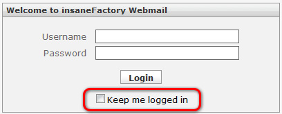
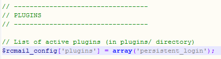
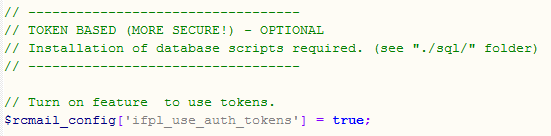

# Persistent Login (Roundcube)
This server-side plugin is useful for all Roundcube users who don’t like to log into their mail account each time they open their browser. The plugin stores a persistent login cookie which automatically logs the user in the next time he or she visits the [Roundcube](http://roundcube.net/) web mailer.

## Screenshots

## Download
You can download the plugin from the [Sourceforge project page.](https://sourceforge.net/projects/rcmailifpl/files/)

Sources from [GitHub.](https://github.com/mfreiholz/Roundcube-Persistent-Login-Plugin)

## Installation
__Step 1:__ Extract the “persistent_login” folder into roundcube’s plugin directory `<roundcube>/plugins/`.

__Step 2:__ Open the Roundcube main configuration file `<roundcube>/config/main.inc.php` and add the plugin’s name to the active plugins array (See screenshot):

### Update to version 2.0 (from all < 2.0)
If you use the AuthToken based authentication, than you have to open the \*.sql script in the plugin’s `sql/` folder and execute each statement which is listed under the “Update Version 2.0″ section.

That’s all!

## Configuration
The plugin provides two different ways of usage. User-Data cookie or AuthToken cookie based.

### UserData cookie (No database extension required)
This method doesn’t require any configuration, it is enabled by default. It stores the user’s login information encrypted in a cookie.

### AuthToken cookie (more secure, recommended)
This method have to be enabled in the plugins configuration file. It requires the creation of a table in your __roundcubemail’s database__ as well. The table can be created by the SQL script in the `sql/` directory of the plugin. Execute ALL statements from the SQL file.

