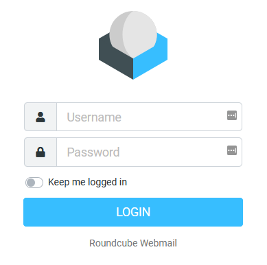

# Persistent Login (Roundcube)
Provides a "Keep me logged in" aka "Remember Me" functionality for [Roundcube][roundcube].



## Download
You can download the plugin from the latest [release tags][github-release] on GitHub.

## Installation
- Extract the downloaded archive into Roundcube’s plugin directory
  `<roundcube>/plugins/` and rename it to `persistent_login`.

- Open the Roundcube's main configuration file `<roundcube>/config/main.inc.php`
  and add the plugin’s name to the active plugins array, e.g.:

```php
$config['plugins'] = array('persistent_login');
```

Thats it. All configuration is optional.

## Configuration (Optional)
Persistent Login provides two different ways of usage.
User-Data cookie or AuthToken cookie based.

### UserData cookie (No database extension required)
This method doesn’t require any configuration, it is enabled by default.
It stores the user’s login information encrypted in a cookie.

### AuthToken cookie (more secure, recommended)
This method have to be enabled in the plugins configuration file.
It requires the creation of a table in your __roundcubemail’s database__ as well.
The table can be created by the SQL script in the `sql/` directory of the plugin.
Execute ALL statements from the SQL file.

Enable it in config: `persistent_login/config.inc.php`
```php
$rcmail_config['ifpl_use_auth_tokens'] = true;
```

[roundcube]: http://roundcube.net/
[github-release]: https://github.com/mfreiholz/persistent_login/releases